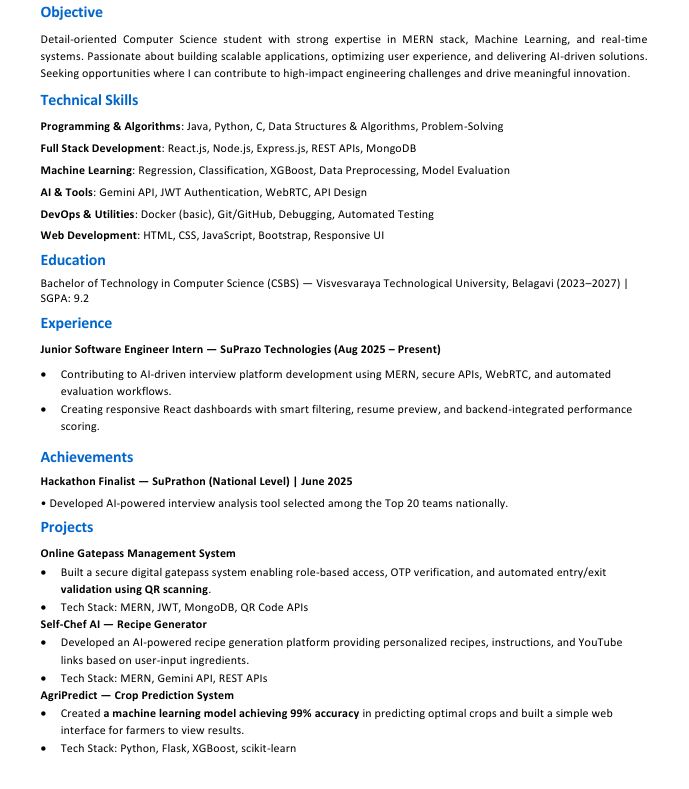

# Resume Parsing & Examination System  
**Hybrid NLP + LLM | Hallucination-Safe | Flask API**

---

## 1. Project Overview

This project implements a **production-grade resume parsing system** that converts unstructured resume text into structured JSON **without hallucination**.

Unlike naïve LLM-based parsers, this system uses a **hybrid architecture**:

- Rule-based / NLP heuristic parsing  
- Strict LLM-based extraction  
- LLM-based examiner (arbiter)  
- Robust JSON validation  
- Flask API for external integration  

The system guarantees:
- No invented data  
- Schema correctness  
- Deterministic outputs  
- Safe handling of LLM failures  

---

## 2. Why This Project Exists

LLMs are powerful but unreliable for structured extraction:

- They hallucinate  
- They truncate JSON  
- They rewrite content  
- They return non-JSON outputs  

This project solves those problems by:

- Treating LLMs as **extractors**, not generators  
- Validating everything against raw resume text  
- Using an **examiner LLM** to arbitrate correctness  
- Enforcing strict schemas at every stage  

---

## 3. High-Level Architecture
```
                            Raw Resume Text
                                    |
                                    v
                            Section Detection
                                    |
                                    +-----------------------+
                                    |                       |
                                    v                       v
                            NLP Heuristic Parser     LLM Strict Extractor
                                    |                       |
                                    +-----------+-----------+
                                                |
                                                v
                                      Resume Examiner LLM
                                                |
                                                v
                                       Final Parsed Resume JSON
                                                |
                                                v
                                            Flask API

```


---

## 4. System Components

### 4.1 Input
- Input is **raw resume text**
- PDF/DOC conversion is assumed to be handled externally
- No formatting assumptions are made

---

### 4.2 NLP / Heuristic Parser
- Uses deterministic rules and patterns
- Extracts:
  - Skills
  - Experience
  - Projects
  - Achievements
- Pros:
  - Fast
  - No hallucination
- Cons:
  - Schema inconsistencies possible
  - Misses complex structures

---

### 4.3 LLM Strict Extractor
- Uses `mistralai/Mistral-7B-Instruct-v0.2`
- Operates under **copy-only rules**
- Guarantees:
  - No inference
  - No enrichment
  - No rewriting
- Output strictly follows schema
- Common failures handled:
  - Truncated JSON
  - Prompt echo
  - Partial outputs

---

### 4.4 Resume Examiner LLM
- **Does NOT extract data**
- Compares:
  - Raw resume text (ground truth)
  - NLP parser output
  - LLM extractor output
- Decides which output is **more correct**
- Penalizes:
  - Schema violations
  - Hallucinated fields
  - Missing or extra entries

**Output format:**
```json
{
  "selected_approach": "nlp_heuristic | llm_extraction",
  "reason": "short factual sentence"
}
```
---
## 4.5 Safety & Validation Layer
Implemented protections:

- _safe_json():
- Accepts JSON
- Accepts Python-dict style output
- Rejects truncated responses
- Retry-once strategy for LLM calls
- Safe fallback if examiner fails
- System never returns raw LLM text
---
## 5. Output Schema
```
{
  "experience": [
    {
      "company": "",
      "role": "",
      "duration": "",
      "description": ""
    }
  ],
  "projects": [
    {
      "name": "",
      "description": "",
      "techstack": []
    }
  ],
  "skills": [],
  "achievements": []
}

```
---
## 6. Example Input (Resume Image)


---

## 7. Example Output (Final JSON)
```
{
  "skills": [
    "Java",
    "Python",
    "C",
    "Data Structures & Algorithms",
    "Problem-Solving",
    "React.js",
    "Node.js",
    "Express.js",
    "REST APIs",
    "MongoDB",
    "Regression",
    "Classification",
    "XGBoost",
    "Data Preprocessing",
    "Model Evaluation",
    "Gemini API",
    "JWT Authentication",
    "WebRTC",
    "API Design",
    "Docker (basic)",
    "Git/GitHub",
    "Debugging",
    "Automated Testing",
    "HTML",
    "CSS",
    "JavaScript",
    "Bootstrap",
    "Responsive UI"
  ],
  "experience": [
    {
      "company": "SuPrazo Technologies",
      "role": "Junior Software Engineer Intern",
      "duration": "Aug 2025 – Present",
      "description": "Contributing to AI-driven interview platform development using MERN, secure APIs, WebRTC, and automated evaluation workflows. Creating responsive React dashboards with smart filtering, resume preview, and backend-integrated performance scoring."
    }
  ],
  "projects": [
    {
      "name": "Online Gatepass Management System",
      "description": "Built a secure digital gatepass system enabling role-based access, OTP verification, and automated entry/exit validation using QR scanning.",
      "techstack": [
        "MERN",
        "JWT",
        "MongoDB",
        "QR Code APIs"
      ]
    },
    {
      "name": "Self-Chef AI — Recipe Generator",
      "description": "Developed an AI-powered recipe generation platform providing personalized recipes, instructions, and YouTube links based on user-input ingredients.",
      "techstack": [
        "MERN",
        "Gemini API",
        "REST APIs"
      ]
    },
    {
      "name": "AgriPredict — Crop Prediction System",
      "description": "Created a machine learning model achieving 99% accuracy in predicting optimal crops and built a simple web interface for farmers to view results.",
      "techstack": [
        "Python",
        "Flask",
        "XGBoost",
        "scikit-learn"
      ]
    }
  ],
  "achievements": [
    "Hackathon Finalist — SuPrathon (National Level) - Developed AI-powered interview analysis tool selected among the Top 20 teams nationally."
  ]
}
```


